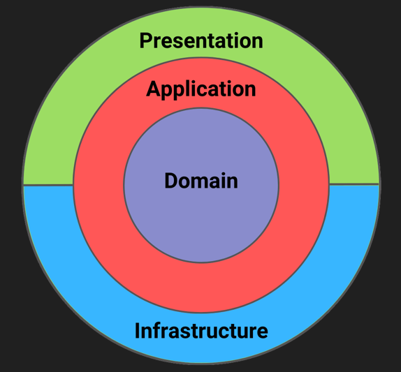

# 🏗️ Next.js Frontend Project - Clean Architecture

This project follows the **Clean Architecture** principles applied to a **Frontend application** built with **Next.js**. The goal is to provide a clear separation of concerns, scalable code structure, and maintainability by defining layers that isolate business logic from infrastructure and presentation.

---

## ⚙️ What is Clean Architecture?

**Clean Architecture**, introduced by Robert C. Martin (Uncle Bob), promotes a layered architecture that places the **business rules and logic** at the center of the application, independent of frameworks, databases, or external agencies.

> **Key Benefits:**
> - **Framework Independent:** Your application isn't tied to any technology.
> - **Testability:** Each layer can be tested in isolation.
> - **Maintainability & Scalability:** Clean separation between UI, business logic, and infrastructure.
> - **Flexibility:** Easily swap out technologies (frameworks, DB, etc.) without impacting business rules.

---

## 🧭 Layers Overview

Here is a breakdown of the main layers in this architecture:

1. **Domain**  
   ➡️ Pure business rules and entities. No dependencies on external code or services.

2. **Application**  
   ➡️ Orchestrates use cases and application-specific logic. Connects the domain with the outside world.

3. **Infrastructure**  
   ➡️ Implements integrations with external services (API calls, databases, authentication providers).

4. **Presentation**  
   ➡️ UI components, containers, and frontend utilities.

5. **App (Next.js App Router)**  
   ➡️ Responsible for routing, layouts, and page rendering based on Next.js conventions.

---

## 🗂️ Project Structure

```plaintext

src
├── app                # Next.js routing & layouts (App Router)
├── application        # Application logic orchestration (use cases, actions)
├── config             # Global app configurations and environment setups
├── domain             # Core business logic and domain models
├── infrastructure     # External service implementations (gateways, persistence)
└── presentation       # UI layer (components, containers, styles)

```

---

## 🗃️ Folder Responsibilities

### 📁 app

**Responsibility:**  
Handles routing and layout structure using **Next.js App Router**.

**Includes:**

- `page.tsx`: Route pages.
- `layout.tsx`: Layout templates shared between routes.
- `api/`: Serverless API routes (if used).

**Example:**

app/dashboard/layout.tsx app/dashboard/page.tsx 
app/api/auth/[...nextauth]/route.ts

➡️ See [app/README.md](./app/README.md)

---

### 📁 application

**Responsibility:**  
Coordinates the application logic, executing use cases and managing flow between domain and infrastructure.

**Includes:**

- `actions/`: Executes client/server actions.
- `auth/`: Handles authentication/session logic.
- `decorators/`: Provides decorators for error handling, logging, etc.
- `mappers/`: Maps data between domain models and external representations.
- `utils/`: Utility functions used by actions and services.
- `validations/`: Zod/Yup validation schemas for request/response validation.

**Example:**

application/actions/server/user-actions.ts 
application/validations/auth-validations.ts

➡️ See [application/README.md](./application/README.md)

---

### 📁 config

**Responsibility:**  
Contains global app configuration, environment variables, and third-party service setups.

**Includes:**

- `auth.config.ts`: Authentication provider configuration.
- `.env`: Environment variables loaded from the environment.

➡️ See [config/README.md](./config/README.md)

---

### 📁 domain

**Responsibility:**  
Contains the core business logic and rules. Pure, framework-agnostic code with no dependencies on external libraries.

**Includes:**

- `contracts/`: Interfaces for repositories, services, and gateways.
- `dto/`: Data Transfer Objects between layers.
- `enum/`: Business-specific enums (roles, states, etc.).
- `models/`: Domain entities and core data models.
- `use-cases/`: Application use cases that represent business operations.

**Example:**

domain/models/User.ts 
domain/use-cases/common.use-cases.ts

➡️ See [domain/README.md](./domain/README.md)

---

### 📁 infrastructure

**Responsibility:**  
Implements details of how the application interacts with external systems such as APIs or databases.

**Includes:**

- `gateways/`: HTTP clients or SDK wrappers to interact with external services.
- `persistence/`: Persistence layer (if applicable), accessing storage or caching services.

**Example:**

infrastructure/gateways/HttpGateway.ts

➡️ See [infrastructure/README.md](./infrastructure/README.md)

---

### 📁 presentation

**Responsibility:**  
Defines the user interface, components, and hooks that handle the display logic and user interaction.

**Includes:**

- `components/`: Reusable UI components (buttons, modals, inputs).
- `containers/`: Components connected to business logic or state management.
- `constants/`: UI constants like routes, metadata, etc.
- `functions/`: Frontend utility functions.
- `lib/`: Custom frontend hooks and libraries.
- `styles/`: Global or component-specific styles.
- `types/`: TypeScript types specific to the UI.

**Example:**

presentation/components/common/modal.tsx 
presentation/containers/tournament/server/TournamentDashboard.tsx

➡️ See [presentation/README.md](./presentation/README.md)

---

## 🖼️ Clean Architecture Diagram



---

## ✅ Best Practices

1. **Do not cross layer responsibilities.**  
   Example: Presentation should never directly interact with Infrastructure.

2. **Inner layers should not depend on outer layers.**  
   The Domain layer must remain pure and isolated.

3. **Write unit tests for use-cases and domain models.**

4. **Document each folder with its own README.md.**  
   Every layer should be self-explanatory and well-documented.

---

## 📚 Example from this Project

This project implements Clean Architecture in a toll management system built with Next.js. One of its core modules includes the management of vehicles, allowing users to register, edit, and view vehicle information linked to toll operations.

Below is an example of the folder structure highlighting the vehicle-related components and their locations across the layers:

```plaintext

src
├── app
│ └── dashboard
│ └── vehicle
│ └── [plate]
│ └── page.tsx
├── application
│ └── actions
│ └── server
│ └── vehicle-actions.ts
├── domain
│ └── models
│ └── Vehicle.ts
├── infrastructure
│ └── gateways
│ └── HttpGateway.ts
└── presentation
└── components
└── ui
└── button.tsx
```
---

## 🚀 How to Use this Structure

- Create new domain entities inside `/domain/models`.
- Write new use cases inside `/domain/use-cases`.
- Implement infrastructure gateways in `/infrastructure/gateways`.
- Create UI components inside `/presentation/components`.
- Add new routes and pages inside `/app`.

---

## 📎 References

- [Clean Architecture by Uncle Bob](https://8thlight.com/blog/uncle-bob/2012/08/13/the-clean-architecture.html)  
- [Next.js Documentation](https://nextjs.org/docs)

